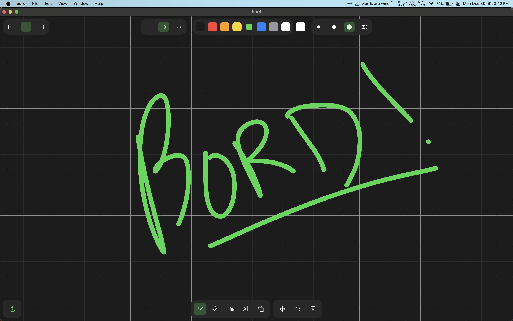

#  bord
## by aditya patel

worked on project for a few weeks Dec 2024

inspired by mspaint and various other drawing tools

cant say the code is amazingly clean, but good enough to work with

## uses

1. quick diagramming
    - open -> digramming time is as fast i could make it
    - 

### things i learned

1. mvvm in swift
    - honestly just started coding and it worked
    - this approach has issues, however, codebase isn't up to best design standards 
    - 
2. graphics
    - didn't delve into metal, but used core graphics for most things
    - transformations, drawing, efficient rendering
    - in the future, might use metal for better performance

